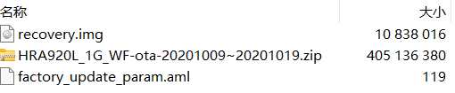
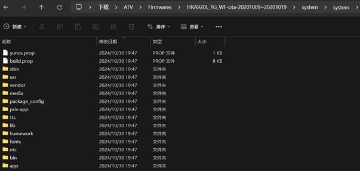
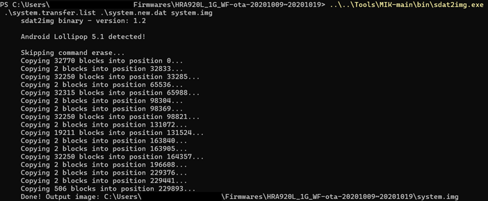

# 海尔电视刷机记录

## 警告

1. __此记录仅供学习参考,请勿用于非法用途__
2. __如果你看完一遍仍然不懂请立即停止相关操作__
3. __刷机前请先备份好数据__
4. __注意用电安全__

## 型号

- **型号**: HRA920L_1G_WF/Haier-MM-920/海尔LE42C3
- **系统**: Android 5.1.0

## 记录

### ADB调试

进入信号源切换界面,按照次序按下遥控器的确认键周围的"← ← ↑ →"即可打开工厂菜单,其中有ADB调试和串口输出开关,都需要打开

### 刷机包

1. 获取原厂OTA升级包

    

    淘宝搜索型号5R购买,获取到的刷机包为原厂刷机包,该刷机包存在签名,修改后升级时将提示校验失败并自动回退,因此只能用于恢复系统

2. 解包"system.img"文件

    我们需要用到刷机包中的`system.img`文件,但固件文件中并不存在,因此需要将固件文件中的`system.img`提取出来修改并重新打包

    将"HRA920L_1G_WF-ota-20201009~20201019.zip"文件整个拖到 [MIK](https://github.com/CryptoNickSoft/Multi_Image_Kitchen) 软件中进行解压

    

    

    修改解压后的 "system" 文件夹内容,图中为改动部分,右侧为修改版本,删除了自带的启动器/影视APP/语音输入法/广告APP/系统更新APP,并添加了更新的"Android System WebView"/第三方启动器/当贝应用市场

    

    修改"apphomelist.txt"文件,该文件是启动器白名单,将第三方启动器的包名添加到其中

    

    修改"appwhitelist.txt"文件,该文件是APP白名单,将第三方启动器的包名添加到其中

    

    "appblacklist.txt"文件为APP黑名单,根据需要修改

    "allowbackgroundapp.list"文件为APP后台允许名单,根据需要修改

3. 打包"system.img"文件

    完成修改后,将第二步获取到的整个"HRA920L_1G_WF-ota-20201009~20201019"文件夹拖到 [MIK](https://github.com/CryptoNickSoft/Multi_Image_Kitchen) 进行打包,重新生成 "system.new.dat" 和 "system.transfer.list" 文件

    在"system.new.dat"文件所在目录执行以下命令,其中"sdat2img.exe路径根据本地环境修改":

    ```powershell
    ..\..\Tools\MIK-main\bin\sdat2img.exe  .\system.transfer.list .\system.new.dat system.img
    ```

    
    

### 进入UBOOT模式

#### HDMI法

网络上似乎有从HDMI接口连接TTL的工具,而且电视硬件上确实有一路TTL连接到HDMI接口,但是没有相关的线缆和工具,此处省略

#### 拆机法

1. 断开电视机电源,尝试开机以消耗机器内电容存储的电量,拆开电视后面板,小心不要触碰到大电容的非绝缘部分
2. 焊接串口点位(TX,RX,GND)
3. 使用USB转TTL连接到电脑
4. 使用Putty/MobaXterm打开串口,设置115200波特率
5. 上电遥控或按键开机,同时串口工具不停按下回车以打断正常启动流程进入UBOOT模式

### 刷机

1. 将上面获得的"system.img"文件放入U盘,插入到电视
2. 通过串口发送命令"usb_update system system.img"
3. 等待刷机完成,断电重启或输入"reboot"重启

### 相关文件

[Haier LE42C3](https://www.alipan.com/s/mSMDuixv12m?pwd=r0t6) 提取码 r0t6

### 参考资料

1. [(TTL)全网首发！全晶晨盒子无敌刷固件方法](https://www.right.com.cn/FORUM/thread-8254433-1-1.html)
2. [Windows下轻松定制Android ROM（解包，增删模块，打包）](https://idoremember.com/posts/android_rom/)